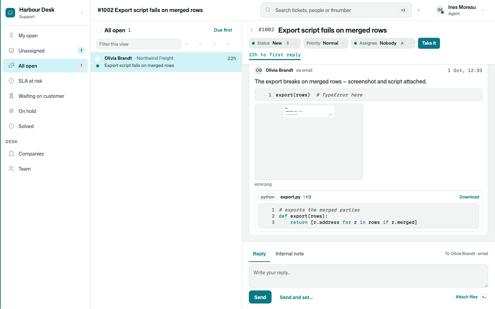

# Osysharp.Mail.Receiving

Your app **watches a mailbox** — `support@yourcompany.com` in Google Workspace, Microsoft 365, or any IMAP account —
and does something with every mail that arrives: opens a ticket, continues a conversation, files an invoice. It is
never a mail server. The mail arrives where it always did, people can still read that inbox, and the app takes what
is new — PUSHED the moment it lands where the provider can push (Gmail, Microsoft 365), asked for on an interval
otherwise (IMAP), and asked every half hour anyway as a safety net.

```osy
// app.osy
use Osysharp.Mail@0;
use Osysharp.Mail.Receiving@0;
use Osysharp.Mail.Gmail@0 { egress "oauth2.googleapis.com"; egress "gmail.googleapis.com"; }
```

```osy
// model/mail.osy
using Osysharp.Mail;
using Osysharp.Mail.Gmail;
using Osysharp.Mail.Receiving;

app.Mail = new MailSetup {
  Mailboxes = [new GmailMailbox { Address = "support@acme.com", ClientId = "…apps.googleusercontent.com",
                                  ClientSecret = Secret.GoogleClientSecret, RefreshToken = Secret.SupportMailbox }],
  Receiver  = new MailIntoConversations(),   // from Osysharp.Conversations.Mail — or your own IMailReceiver
};

// Received mail is customer data: nobody reads it until you say who.
partial entity ReceivedMail { security { allow read when IsAgent; } }
partial entity MailboxWatch { security { allow read, create when IsAdmin; } }

// Once — an admin's "Connect" button, or your setup.
public MailboxWatch ConnectSupport() { return WatchMailbox("support@acme.com"); }

// Push: where providers notify, and the door they notify (a package opens no routes — the app publishes it).
//   app.Mail = new MailSetup { …, PushPath = "/api/rest/v1/mail-push" };
app.Apis = [ new RestApi("MailPush") { Route = "mail-push", Auth = new ApiAuth { Anonymous = true },
  Endpoints = [ new Endpoint(MailboxPushed) { Method = HttpMethod.Post, Path = "/{provider}", Raw = true,
    Query = ["validationToken"], ContentType = "text/plain", OidcIssuer = "https://accounts.google.com" } ] } ];
```

## What you get

- **Push first, never missed.** A mailbox that can push is subscribed when it is watched and renewed before it lapses,
  by this kit's durable workflow; a push wakes a fetch from where the last one stopped (a burst is one fetch); a
  half-hourly poll catches anything a provider dropped; a mailbox whose push cannot be set up says why and is polled.
  Every interval is computed, so the app's plan minimum holds it — a free app polls no more than every 15 minutes.
- **Every mail once.** Each message is kept — with its whole original — before anything acts on it; a retried poll, or
  a mail sent to two of your addresses, is one message.
- **Handed over after the commit.** Your receiver runs in its own unit of work; if it throws, what it did is undone and
  it is tried again, backing off, for a day, then marked Failed with the reason, for staff to send through again.
- **Replies from the same mailbox.** A message whose `From` is a watched mailbox goes out through it — threaded, and
  in that mailbox's Sent folder.
- **No history import.** A mailbox connected today starts today. A provider that loses its place says so on the watch
  and resumes from now; nothing arrives twice.
- **Erasable.** `EraseMailFrom(address)` forgets everything a person sent, originals included.
- **A settings page (0.3.0).** Settings → Channels → **Mailboxes**: each mailbox watched or not, pushed or polled and
  why, when it was last asked, what is wrong; start and stop watching; Connect with the provider's consent; and the mail
  that could not be handed on, sent through again with one press. It is for whoever `ManagesMailboxes` — your app's own
  `IsAdmin` unless you say otherwise (`policy ManagesMailboxes => IsLead;`) — and lists itself in your settings area.

The mailboxes are their own packages: [`Osysharp.Mail.Gmail`](https://osyrin.com/templates/kits/mail-gmail/),
[`Osysharp.Mail.Microsoft365`](https://osyrin.com/templates/kits/mail-microsoft365/) and [`Osysharp.Mail.Imap`](https://osyrin.com/templates/kits/mail-imap/).
The [Harbour helpdesk](https://osyrin.com/templates/helpdesk/) watches a demo mailbox (rows standing in for a provider), and a mail to it opens a ticket — with its
screenshot and its attached script shown on the ticket:



## Source and tests

`model/Receiving.osy` is the whole package. `tests/` is its specification — a fake mailbox at the `IMailbox` seam,
asserting what was KEPT and what the receiver was HANDED.
